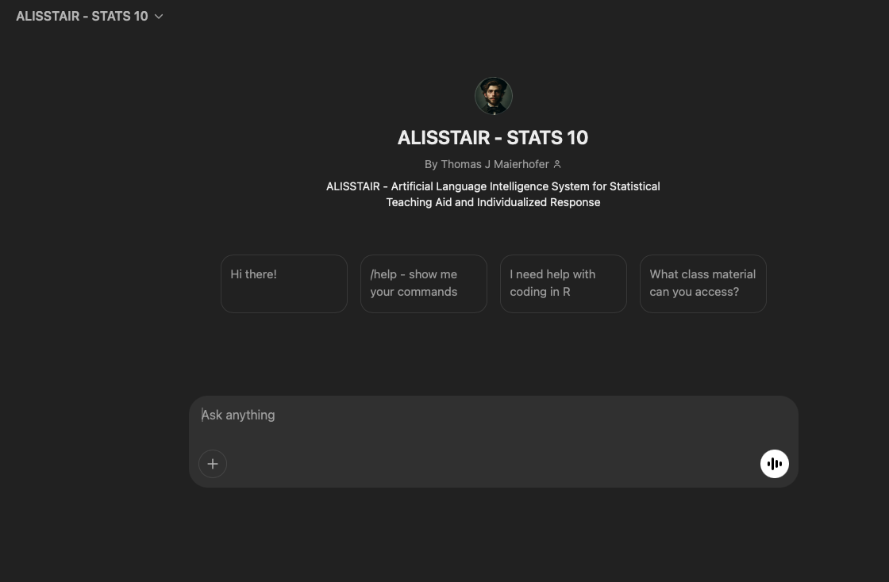

```{=html}
<div class="projects-container">
    
    <div class="project-item">
        <a href="stats20_project.html">  <!-- Change to .html -->
            
            <h3>Undergraduate TA <br> UCLA - STATS 20</h3>
        </a>
    </div>

    <div class="project-item">
        <a href="alisstair_project.html">  <!-- change to .html -->
            
            <h3>ALISSTAIR Implementation <br> UCLA - STATS 10</h3>
        </a>
    </div>

</div>
```
